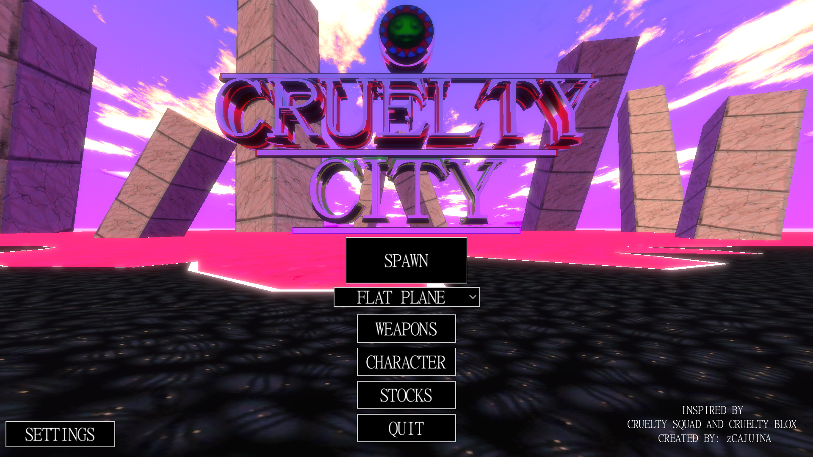

# 👁️ CRUELTY-CITY-PROJECT

An open-source, FPS framework inspired by Vile Kallio's *Cruelty Squad*, built from the ground up using the **Godot Engine**.

---

<!-- DICA: Coloque um GIF ou imagem bem marcante do jogo aqui para prender a atenção de quem entra no repositório -->

  

## 📌 About the Project

This project was originally conceived after the takedown of **CRUELTY BLOX**. The goal was to rebuild the experience while preserving the chaotic open-world philosophy and non-linear gameplay of the original material .

My main objective was to program a **rock-solid technical foundation** for a shooter before shifting focus to major visual environments and level design . Since 3D environmental modeling and map layouts are not my strongest suits, the project currently features a functional sandbox testing ground .

After nearly a year of solo development—navigating complex systems, asset modeling, and intense creative blocks—this repository serves as a fully featured base . Whether you want to study the codebase, learn Godot systems architecture, or help expand the world, you are free to explore and build upon it !

---

## 🛠️ Features Implemented

The architecture utilizes a robust **State Machine** for First-Person movement alongside deep structural replicas of classic mechanics:

- **🔫 Modular Weapons System:** Easily expandable weapon logic and gunplay mechanics.
- **📈 Dynamic Stock Market:** Fully simulated economy including corporate stocks, traded organs, and fish market value.
- **🎣 Modular Fishing System:** Hook, catch, and economy-integrated fishing loop.
- **🧬 Implants & Bio-Augments:** Modular player upgrade slots changing core gameplay attributes.
- **🩸 Organ Harvesting:** Post-mortem looting mechanics for market trade.
- **🎨 Character Customization:** System prepared for player cosmetic modding .
- **💬 Text-Advance Dialogue System:** Retro-style typewriter dialogue UI mimicking the original aesthetic .
- **🔮 Ancient Altars:** Special gameplay-modifier mechanics carried over from *Cruelty Blox* lore .
- **⏳ Day/Night Cycle:** Global environment and atmospheric time progression .

> ⚠️ **Current State:** The release includes a **flat plane sandbox map** designed explicitly to stress-test all the functional features and entities listed above.
> ⚠️ **Current Code State:** This project is almost 2 years old, and has gone trough a lot of changes, so if you are trying to continue it, be warned to see a couple useless code and scene files

---

## 🚀 How to Run & Play

### For Players (Play the Sandbox)
If you just want to test the mechanics without touching the engine:
1. Go to the [Releases](https://github.com/zcajuina/CRUELTY-CITY-PROJECT/releases) page on the right.
2. Download the compiled build for your OS.
3. Unzip and run the executable.

### For Developers (Godot Engine)
1. Clone this repository: `git clone https://github.com/zcajuina/CRUELTY-CITY-PROJECT.git`
2. Open **Godot 4.x** (Stable).
3. Import the `project.godot` file.
4. Press `F5` to run the sandbox setup.

---

## 🤝 Contributing (Calling Level Designers!)

As mentioned, **the system framework is complete, but the game needs a world !** 

If you are a 3D artist, level designer, or Godot programmer interested in creating maps or optimization tweaks, contributions are highly welcome .
- Feel free to open an **Issue** to discuss ideas.
- Submit a **Pull Request** with map scenes, blockouts, or bug fixes.

---

## 📇 Credits & Acknowledgments

* **zCAJUINA:** Core systems programming and 3D asset modeling.
* **Vile Kallio:** Original game concept, creative direction, and texture inspirations.
* **Starly:** Badge design ([Instagram: @s4tarlyy](https://instagram.com/s4tarlyy)) .
* **Plodeth, WannaCry, and Wrench:** For their dedication to keeping the *CRUELTY BLOX* community alive.

---
*Disclaimer: This is a non-commercial, open-source fan project made for educational purposes and community engagement.*
